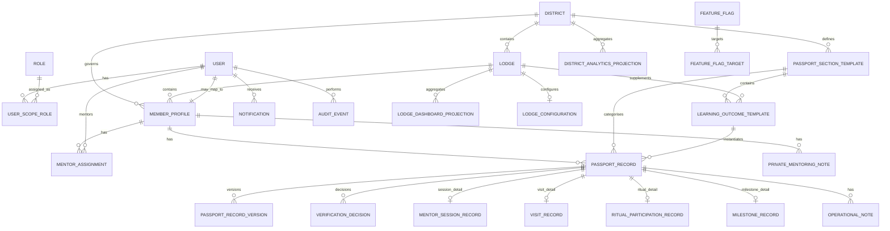

# DGLEA Masonic Passport — Domain Model and ERD

**Document Status:** Draft v1  
**Intended Repository Use:** Save as `.md` in GitHub  
**Project:** DGLEA Masonic Passport  
**Date:** 2026-04-06  

---

## 1. Purpose

This document defines the **core domain model** and the initial **entity relationship design** for the DGLEA Masonic Passport platform.

This is one of the most important build-start documents because schema ambiguity is where good architecture often collapses into accidental design.

The goal here is not to over-model everything. The goal is to define the core entities, boundaries, and relationships clearly enough that implementation can begin without Codex inventing its own implicit data model.

---

## 2. Modelling Principles

1. **District core and lodge supplements must remain distinguishable**
2. **Template data and user progress data must not be collapsed**
3. **Submitted and verified states must not be collapsed**
4. **Operational records and private mentoring notes must not be collapsed**
5. **Historical truth must be preserved**
6. **Permissions and organisational scope must be queryable**
7. **Audit must be first-class, not an afterthought**

---

## 3. Core Domain Areas

The model is divided into these domain areas:

- Organisation and scope
- Identity and role assignment
- Member profile and mentor relationships
- Passport templates
- Passport progress records
- Verification workflow
- Notifications
- Reporting projections
- Audit
- Configuration and feature flags

---

## 4. Core Entities

## 4.1 Organisation and Scope

### District
Represents the district that governs the participating lodges.

Suggested fields:
- `id`
- `name`
- `code`
- `status`
- `created_at`
- `updated_at`

### Lodge
Represents an individual lodge inside the district.

Suggested fields:
- `id`
- `district_id`
- `lodge_number`
- `name`
- `short_name`
- `status`
- `timezone`
- `created_at`
- `updated_at`

---

## 4.2 Identity and Role Assignment

### User
Represents a platform user account.

Suggested fields:
- `id`
- `email`
- `mobile_number`
- `given_name`
- `family_name`
- `display_name`
- `status`
- `last_login_at`
- `created_at`
- `updated_at`

### Role
Represents a named role.

Suggested seed roles:
- `BROTHER`
- `PERSONAL_MENTOR`
- `LODGE_MENTOR`
- `LODGE_REVIEWER`
- `LODGE_ADMIN`
- `DISTRICT_MENTOR`
- `DISTRICT_ADMIN`
- `SYSTEM_ADMIN`

Suggested fields:
- `id`
- `code`
- `name`
- `description`

### UserScopeRole
Assigns a role to a user in an organisational scope.

Suggested fields:
- `id`
- `user_id`
- `role_id`
- `district_id` nullable
- `lodge_id` nullable
- `scope_type`
- `active_from`
- `active_to`
- `status`
- `created_at`
- `updated_at`

**Reason this entity matters:**  
A user may hold multiple roles, and those roles are not all global.

---

## 4.3 Member Profile and Mentor Relationships

### MemberProfile
Represents the Brother whose passport is being tracked.

Suggested fields:
- `id`
- `user_id`
- `district_id`
- `lodge_id`
- `membership_number` nullable
- `date_joined_platform`
- `degree_status`
- `initiated_at` nullable
- `passed_at` nullable
- `raised_at` nullable
- `solomon_registered_at` nullable
- `status`
- `created_at`
- `updated_at`

### MentorAssignment
Represents assignment of a mentor to a member.

Suggested fields:
- `id`
- `member_profile_id`
- `mentor_user_id`
- `mentor_role_type`
- `lodge_id`
- `is_primary`
- `active_from`
- `active_to`
- `status`
- `created_at`
- `updated_at`

**Important note:**  
Do not assume one mentor relationship type fits all. A Personal Mentor and a Lodge Mentor are different concepts operationally.

---

## 4.4 Passport Template Model

### PassportSectionTemplate
Represents the district-approved passport sections.

Seed examples:
- `ENTERED_APPRENTICE`
- `FELLOW_CRAFT`
- `MASTER_MASON_AND_BEYOND`
- `PREPARING_FOR_OFFICE`

Suggested fields:
- `id`
- `district_id`
- `code`
- `name`
- `display_order`
- `description`
- `is_district_core`
- `status`
- `created_at`
- `updated_at`

### LearningOutcomeTemplate
Represents an individual district-standard or lodge-supplement item within a section.

Suggested fields:
- `id`
- `section_template_id`
- `lodge_id` nullable
- `item_code`
- `title`
- `description`
- `item_type`
- `display_order`
- `verification_required`
- `is_district_core`
- `status`
- `created_at`
- `updated_at`

### ItemType (conceptual enumeration)
Suggested types:
- `LEARNING_OUTCOME`
- `MENTOR_SESSION`
- `VISITATION`
- `RITUAL_PARTICIPATION`
- `MILESTONE`
- `ANNUAL_COMMUNICATION`
- `PREPARING_FOR_OFFICE`
- `CUSTOM_SUPPLEMENT`

---

## 4.5 Passport Record Model

### PassportRecord
Represents a concrete record for a member against a template item or a governed lodge-level supplement.

Suggested fields:
- `id`
- `member_profile_id`
- `section_template_id`
- `learning_outcome_template_id` nullable
- `record_type`
- `title_snapshot`
- `description_snapshot` nullable
- `event_date` nullable
- `status`
- `current_version`
- `is_official_progress`
- `lodge_id`
- `district_id`
- `created_by_user_id`
- `created_at`
- `updated_at`

**Why snapshots matter:**  
If template text changes later, historical records should still preserve what the item represented at that time.

### PassportRecordVersion
Represents version history of a passport record.

Suggested fields:
- `id`
- `passport_record_id`
- `version_number`
- `payload_json`
- `change_reason`
- `created_by_user_id`
- `created_at`

**Reason this entity matters:**  
Do not edit verified truth destructively.

### MentorSessionRecord
Optional specialised detail record for mentor sessions.

Suggested fields:
- `id`
- `passport_record_id`
- `session_mode`
- `session_summary`
- `debrief_completed`

### VisitRecord
Optional specialised detail record for visitations.

Suggested fields:
- `id`
- `passport_record_id`
- `visited_lodge_name`
- `visited_lodge_number` nullable
- `constitution_name` nullable
- `degree_observed` nullable
- `debrief_completed`

### RitualParticipationRecord
Optional specialised detail record for ritual participation.

Suggested fields:
- `id`
- `passport_record_id`
- `degree_context`
- `ritual_role_name`
- `participation_notes`

### MilestoneRecord
Optional specialised detail record for major stage events.

Suggested fields:
- `id`
- `passport_record_id`
- `milestone_type`
- `milestone_date`

---

## 4.6 Verification Workflow Model

### VerificationDecision
Represents a mentor action taken on a submitted record.

Suggested fields:
- `id`
- `passport_record_id`
- `decision_type`
- `prior_status`
- `new_status`
- `decision_reason` nullable
- `actor_user_id`
- `actor_role_code`
- `acted_at`
- `created_at`

Suggested `decision_type` values:
- `SUBMITTED`
- `VERIFIED`
- `REJECTED`
- `REQUESTED_CLARIFICATION`
- `OVERRIDDEN`
- `SUPERSEDED`
- `ARCHIVED`

### VerificationQueueProjection
Optional read model for pending/stale workflow items.

Suggested fields:
- `id`
- `passport_record_id`
- `member_profile_id`
- `assigned_verifier_user_id` nullable
- `lodge_id`
- `current_status`
- `submitted_at`
- `stale_after_at`
- `is_stale`

---

## 4.7 Notes and Sensitive Data

### OperationalNote
Workflow-visible note tied to a passport record.

Suggested fields:
- `id`
- `passport_record_id`
- `author_user_id`
- `note_type`
- `content`
- `visibility_scope`
- `created_at`

Suggested note types:
- `GENERAL`
- `CLARIFICATION`
- `VERIFICATION_NOTE`

### PrivateMentoringNote
Restricted note intended for private mentoring use.

Suggested fields:
- `id`
- `member_profile_id`
- `author_user_id`
- `lodge_id`
- `content`
- `visibility_policy`
- `created_at`
- `updated_at`

**Critical rule:**  
This must be modelled separately from normal progress data.

---

## 4.8 Notifications

### Notification
Represents a notification produced by the system.

Suggested fields:
- `id`
- `user_id`
- `notification_type`
- `channel`
- `title`
- `body`
- `related_entity_type`
- `related_entity_id`
- `status`
- `scheduled_at` nullable
- `sent_at` nullable
- `read_at` nullable
- `created_at`

### NotificationTemplate
Optional system template for reusable notification content.

Suggested fields:
- `id`
- `code`
- `channel`
- `subject_template` nullable
- `body_template`
- `status`

---

## 4.9 Audit

### AuditEvent
Represents an important auditable system action.

Suggested fields:
- `id`
- `event_type`
- `entity_type`
- `entity_id`
- `actor_user_id`
- `actor_role_code`
- `district_id`
- `lodge_id`
- `prior_state` nullable
- `new_state` nullable
- `reason` nullable
- `metadata_json` nullable
- `created_at`

---

## 4.10 Reporting and Read Models

### LodgeDashboardProjection
A read model optimised for lodge dashboards.

Suggested fields:
- `id`
- `lodge_id`
- `member_profile_id`
- `degree_status`
- `verified_count`
- `pending_count`
- `clarification_count`
- `last_activity_at`
- `readiness_indicator`
- `updated_at`

### DistrictAnalyticsProjection
A read model optimised for district analytics.

Suggested fields:
- `id`
- `district_id`
- `lodge_id`
- `active_members_count`
- `pending_verifications_count`
- `verified_items_count`
- `inactive_members_count`
- `avg_verification_turnaround_hours`
- `updated_at`

### ReportSnapshot
Represents a generated report or export record.

Suggested fields:
- `id`
- `report_type`
- `scope_type`
- `scope_id`
- `generated_by_user_id`
- `generated_at`
- `file_uri` nullable
- `parameters_json`

---

## 4.11 Configuration and Flags

### FeatureFlag
Represents a feature toggle.

Suggested fields:
- `id`
- `key`
- `name`
- `flag_type`
- `default_state`
- `owner_user_id` nullable
- `description`
- `expires_at` nullable
- `status`
- `created_at`
- `updated_at`

### FeatureFlagTarget
Defines where a feature flag applies.

Suggested fields:
- `id`
- `feature_flag_id`
- `target_type`
- `target_value`
- `created_at`

Examples:
- target a specific lodge
- target a district role
- target staging only

### LodgeConfiguration
Represents lodge-specific governed configuration.

Suggested fields:
- `id`
- `lodge_id`
- `verification_policy`
- `private_notes_enabled`
- `custom_items_enabled`
- `reminder_policy_json`
- `updated_at`

---

## 5. Entity Relationship Overview

---

## 6. Recommended Enumerations

### 6.1 Member Degree Status
- `ENTERED_APPRENTICE`
- `FELLOW_CRAFT`
- `MASTER_MASON`
- `PREPARING_FOR_OFFICE`
- `INACTIVE`
- `ARCHIVED`

### 6.2 Passport Record Status
- `DRAFT`
- `SUBMITTED`
- `NEEDS_CLARIFICATION`
- `VERIFIED`
- `REJECTED`
- `OVERRIDDEN`
- `SUPERSEDED`
- `ARCHIVED`

### 6.3 Mentor Role Type
- `PERSONAL_MENTOR`
- `LODGE_MENTOR`

### 6.4 Verification Policy
- `PERSONAL_MENTOR_ONLY`
- `LODGE_MENTOR_ONLY`
- `EITHER_PERSONAL_OR_LODGE`
- `DUAL_VERIFICATION`

**Recommended default for MVP:**  
`EITHER_PERSONAL_OR_LODGE`

---

## 7. Keys and Constraints

## 7.1 Important Constraints
- a Brother cannot have more than one active `MemberProfile` per lodge
- a Personal Mentor assignment cannot exist without a valid `mentor_user_id`
- a `PassportRecord` cannot be marked official unless status is `VERIFIED`
- a `VerificationDecision` must capture actor and target record
- private mentoring notes must never be mixed into district analytics projections by default

## 7.2 Uniqueness Suggestions
- `Role.code` unique
- `FeatureFlag.key` unique
- `Lodge.lodge_number` unique within district
- `PassportSectionTemplate.code` unique within district
- `LearningOutcomeTemplate.item_code` unique within scope

---

## 8. Read Model Strategy

Not every query should hit the write model raw.

Recommended read models:
- member summary view
- pending verification queue
- lodge dashboard view
- district analytics view
- report snapshot history

This avoids overloading transactional tables with every dashboard query.

---

## 9. Anti-Patterns to Avoid

1. do not put all record types into one unstructured JSON blob
2. do not store templates and completed records in the same indistinct table without type clarity
3. do not edit verified records destructively
4. do not model private mentoring notes as generic comments
5. do not make district analytics depend on ad hoc application logic only
6. do not assume one user equals one role

---

## 10. Final Domain Position

The correct domain model is:

> **District and lodge governance at the top, member profile and mentor assignments in the middle, district-controlled passport templates and governed lodge supplements as the structural layer, and auditable record/verification history as the core operational truth.**
