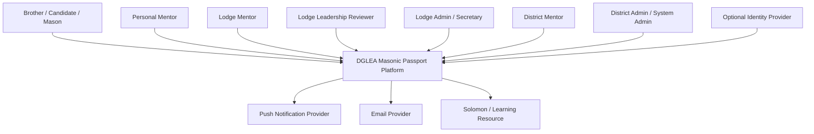
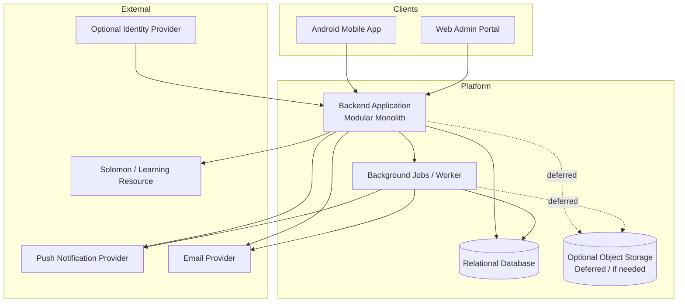
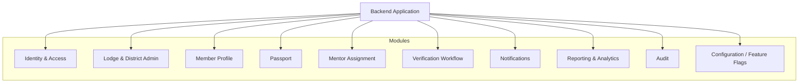

# DGLEA Masonic Passport — System Context and Container Diagrams

**Document Status:** Draft v1  
**Intended Repository Use:** Save as `.md` in GitHub  
**Project:** DGLEA Masonic Passport  
**Date:** 2026-04-06  

---

## 1. Purpose

This document defines the **system context** and **container-level architecture view** for the DGLEA Masonic Passport platform.

It exists to stop two common implementation failures:

1. treating the product as “just an Android app”; and  
2. letting engineering invent runtime components ad hoc during implementation.

The diagrams below are deliberately simple. They are intended to be implementation-guiding, not decorative.

---

## 2. System Context

### 2.1 Context Statement

The DGLEA Masonic Passport platform is a **district-governed mentoring and progression platform** used by Brothers, Personal Mentors, Lodge Mentors, lodge leadership, and district roles across approximately 45 lodges.

The platform digitises the district passport, coordinates verification workflow, provides lodge-level oversight, and supports district analytics and reporting.

### 2.2 External Actors and Systems

#### Human Actors
- **Brother / Candidate / Mason** — records progress, submits entries, views passport
- **Personal Mentor** — reviews and verifies assigned Brothers
- **Lodge Mentor** — lodge-level mentoring coordinator and fallback verifier
- **Lodge Leadership Reviewer** — summary/read-focused governance role
- **Lodge Administrator / Secretary** — lodge administration and setup
- **District Mentor** — district-wide oversight and analytics role
- **District Administrator / System Administrator** — platform governance and support role

#### External Systems
- **Push Notification Provider** — delivers mobile notifications
- **Email Provider** — delivers optional email notifications
- **Solomon / external learning resource** — linked resource, not system of record
- **Identity Provider** — optional future integration if SSO is later adopted

---

## 3. System Context Diagram

---

## 4. Context-Level Responsibilities

### 4.1 What the Platform Owns
The platform owns:
- user role and scope enforcement inside the platform;
- member passport records;
- mentor assignments;
- submission and verification workflow;
- lodge and district dashboards;
- audit logs;
- reports and exports.

### 4.2 What the Platform Does Not Own
The platform does **not** own:
- full ritual texts or secret ritual content;
- Solomon content itself;
- generic email delivery infrastructure as a system of record;
- unrelated lodge administration systems outside the mentoring/passport scope.

---

## 5. Container View

### 5.1 Container Design Position

The platform shall be delivered as:
- one **Android mobile client**
- one **web administration client**
- one **backend application** implemented as a modular monolith
- one **relational database**
- one **background job / worker capability**
- optional object storage later if exports or attachments require it

This is the correct v1 shape.

### 5.2 Container Diagram

---

## 6. Container Responsibilities

### 6.1 Android Mobile App
Primary users:
- Brother
- Personal Mentor
- Lodge Mentor for day-to-day actions

Responsibilities:
- authentication/session handling from the user’s perspective
- dashboard display
- passport viewing
- draft entry creation
- submission actions
- verification actions where permitted
- notification display
- simple local UI state handling

Non-responsibilities:
- authoritative verification logic
- final permission decisions
- readiness truth
- audit truth
- tenancy enforcement

### 6.2 Web Admin Portal
Primary users:
- Lodge Mentor
- Lodge Administrator / Secretary
- Lodge Leadership Reviewer
- District Mentor
- District Administrator / System Administrator

Responsibilities:
- member and lodge administration
- mentor assignment management
- dashboards and analytics
- district oversight views
- export/report screens
- configuration and support tools

Non-responsibilities:
- authoritative workflow truth
- final permission decisions
- authoritative audit logic

### 6.3 Backend Application
Responsibilities:
- business rules
- role and scope enforcement
- tenancy isolation
- verification workflow orchestration
- report generation
- audit generation
- notification triggering
- external integration coordination

### 6.4 Background Jobs / Worker
Responsibilities:
- async notification dispatch
- reminder scheduling
- stale workflow checks
- report/export generation
- housekeeping jobs

### 6.5 Relational Database
Responsibilities:
- authoritative persistence
- transactional integrity
- relational joins and query support
- audit storage
- configuration storage

---

## 7. Internal Backend Module View

The backend modular monolith should be organised by business capability.

---

## 8. Container Interactions

### 8.1 Example — Brother Submits Passport Entry
1. Brother uses Android app
2. Android app sends request to backend
3. Backend validates role, scope, and record state
4. Backend writes submission state to database
5. Backend creates audit event
6. Backend triggers notification job
7. Worker dispatches notification to Personal Mentor and/or Lodge Mentor

### 8.2 Example — Mentor Verifies Entry
1. Mentor uses Android app or web portal
2. Request reaches backend
3. Backend checks assignment/lodge scope and policy
4. Backend transitions state to `verified`
5. Backend updates read models / reporting projections
6. Backend creates audit event
7. Notification sent to Brother

### 8.3 Example — District Mentor Reviews Analytics
1. District Mentor uses web portal
2. Request reaches backend
3. Backend enforces district analytics scope
4. Backend returns aggregated analytics and permitted drill-down data
5. Private mentoring notes remain excluded by default

---

## 9. Data Flow Principles

1. Clients do not directly manipulate database state.
2. Clients always use backend APIs.
3. The backend owns state transitions.
4. The database is the authoritative system of record.
5. Async jobs are used for delivery and scheduled work, not for hiding core business truth.

---

## 10. Security and Trust Boundaries

### 10.1 Trust Boundaries
The main trust boundaries are:
- between clients and backend
- between backend and external providers
- between lodge scope and district scope
- between operational records and private mentoring notes
- between routine workflows and administrative overrides

### 10.2 Non-Negotiable Enforcement Points
Must be enforced in the backend:
- role permissions
- lodge/district scope
- verification state transitions
- audit events
- feature flag targeting

---

## 11. Deferred Containers

These containers are explicitly deferred for v1:
- public API gateway
- dedicated analytics warehouse
- document storage service
- BFF per client
- independent reporting microservice
- event bus platform
- microservice decomposition

---

## 12. Operational Recommendations

### 12.1 Minimum Environment Set
- local development
- shared test / staging
- production

### 12.2 Minimum Operational Controls
- structured logs
- metrics
- exception tracking
- DB backup and restore
- job failure visibility
- audit retention

---

## 13. Final Architecture Position

The correct context and container shape for this project is:

> **An Android-first mentoring platform with a web-based admin and district oversight layer, both backed by a single modular backend application and a relational system of record, with background job support for notifications and reporting.**
