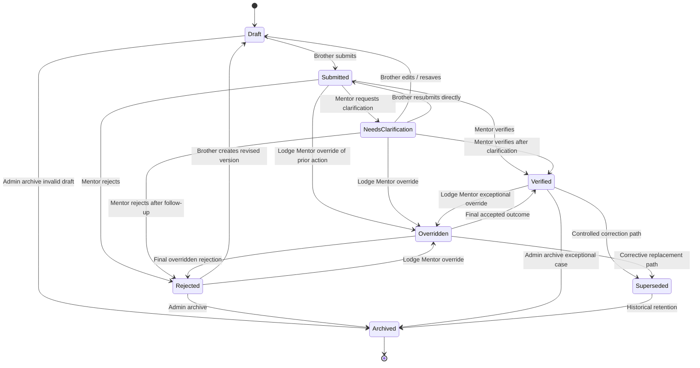

# DGLEA Masonic Passport — Verification Workflow State Diagram

**Document Status:** Draft v1  
**Intended Repository Use:** Save as `.md` in GitHub  
**Project:** DGLEA Masonic Passport  
**Date:** 2026-04-06  

---

## 1. Purpose

This document defines the **verification workflow** for passport records in the DGLEA Masonic Passport platform.

This is one of the most important workflow definitions in the project because the platform only becomes trustworthy if it distinguishes clearly between:

- what a Brother has claimed or entered;
- what a mentor has reviewed;
- what has been accepted as official progress;
- what has been rejected, clarified, corrected, or superseded.

A weak workflow here would reduce the platform to a digital notebook. A strong workflow makes it a governed mentoring record.

---

## 2. Core Design Position

The workflow is built on one non-negotiable rule:

> **A self-submitted item is not an official progress record until it has been verified by an authorised mentor role.**

This means the workflow must preserve:
- record provenance;
- reviewer identity;
- timestamps;
- reasons for rejection or clarification;
- override history;
- correction history.

---

## 3. Actors in the Workflow

### 3.1 Brother / Candidate / Mason
May:
- create draft records;
- edit drafts before submission;
- submit records;
- respond to clarification requests by editing and resubmitting where allowed.

May not:
- verify his own record;
- override a mentor decision.

### 3.2 Personal Mentor
May:
- verify, reject, or request clarification for assigned Brothers where lodge policy allows.

### 3.3 Lodge Mentor
May:
- verify, reject, or request clarification for Brothers in the lodge where policy allows;
- act as fallback verifier;
- override workflow decisions where lodge policy allows and audit is captured.

### 3.4 Lodge Administrator / Secretary
Not a routine verifier.
May participate only in controlled administrative correction paths.

### 3.5 District Mentor
Not a default daily approver.

### 3.6 District Administrator / System Administrator
May access exceptional corrective tooling where necessary, but this must be rare and auditable.

---

## 4. Required Record States

The workflow uses the following states:

- `draft`
- `submitted`
- `needs_clarification`
- `verified`
- `rejected`
- `overridden`
- `superseded`
- `archived`

---

## 5. State Definitions

### 5.1 `draft`
A record being prepared but not yet submitted for mentor review.

### 5.2 `submitted`
A record formally sent for mentor review. It is awaiting a verification action.

### 5.3 `needs_clarification`
A mentor has reviewed the submission but cannot verify it yet because it is incomplete, unclear, or requires correction.

### 5.4 `verified`
The submission has been accepted by an authorised verifier and now counts as an official progress record.

### 5.5 `rejected`
The submission has been reviewed and declined. It does not count as official progress.

### 5.6 `overridden`
A prior mentor decision has been replaced by an authorised Lodge Mentor override. This state exists to preserve audit truth and governance.

### 5.7 `superseded`
A previously valid record has been replaced by a newer corrected record, while retaining the history of the earlier one.

### 5.8 `archived`
A record is retained for history but no longer participates in active workflow. This is an administrative state, not a normal user state.

---

## 6. Canonical Workflow Diagram

---

## 7. Recommended Real-World Interpretation

### 7.1 Normal Path
The normal path should be:

`draft -> submitted -> verified`

This is the default success path and should be fast.

### 7.2 Clarification Path
Where a mentor sees potential merit but not enough clarity:

`submitted -> needs_clarification -> submitted -> verified`

This should be preferred over immediate rejection when the issue is missing detail rather than substantive failure.

### 7.3 Rejection Path
Where the submission is not acceptable:

`submitted -> rejected`

A rejected item does not count toward official progress.

### 7.4 Correction Path
Once a record is verified, later factual correction should not erase history silently.

Use:

`verified -> superseded`

not direct destructive editing.

### 7.5 Override Path
Override is exceptional, not routine. It exists because the Lodge Mentor is accountable for ensuring the process works effectively and may need to resolve workflow deadlocks or incorrect decisions.

---

## 8. Transition Rules

### 8.1 `draft -> submitted`
Triggered by:
- Brother
- mentor acting on behalf of Brother where enabled

Requirements:
- mandatory minimum fields present
- submission timestamp recorded
- submitting actor recorded
- target verification scope resolvable

### 8.2 `submitted -> verified`
Triggered by:
- authorised Personal Mentor under lodge policy
- authorised Lodge Mentor under lodge policy

Requirements:
- verifier identity recorded
- verification timestamp recorded
- record locked against casual editing
- official progress counters updated

### 8.3 `submitted -> rejected`
Triggered by:
- authorised verifier

Requirements:
- rejection reason required
- actor and timestamp recorded
- record remains visible historically

### 8.4 `submitted -> needs_clarification`
Triggered by:
- authorised verifier

Requirements:
- clarification reason required
- actor and timestamp recorded
- Brother notified

### 8.5 `needs_clarification -> draft`
Triggered by:
- Brother re-opens or edits item

Requirements:
- original clarification request preserved
- version history maintained

### 8.6 `needs_clarification -> submitted`
Triggered by:
- Brother resubmits after changes

Requirements:
- new submission timestamp
- optionally version increment
- prior clarification note retained

### 8.7 `verified -> superseded`
Triggered by:
- controlled correction path only
- usually Lodge Mentor or admin-assisted correction

Requirements:
- replacement record linked
- reason required
- prior verified record preserved as historical truth

### 8.8 `* -> overridden`
Triggered by:
- authorised Lodge Mentor only in normal operation
- exceptional admin tooling only under strict audit

Requirements:
- original decision preserved
- override reason mandatory
- override actor and timestamp mandatory
- audit event mandatory

### 8.9 `* -> archived`
Triggered by:
- controlled admin action only

Requirements:
- reason captured
- no silent disappearance from history

---

## 9. State Ownership Matrix

| State | Who Can Create | Who Can Edit | Who Can Exit the State |
|---|---|---|---|
| `draft` | Brother / authorised mentor-on-behalf | Brother / authorised creator | Brother / admin archive |
| `submitted` | Brother / authorised mentor-on-behalf | No casual edit | Authorised verifier |
| `needs_clarification` | Authorised verifier | No direct content edit by verifier | Brother resubmits, verifier rejects/verifies |
| `verified` | Authorised verifier | No direct casual edit | Controlled correction / override / archive |
| `rejected` | Authorised verifier | No direct casual edit | Brother creates revised version, Lodge Mentor override, admin archive |
| `overridden` | Lodge Mentor / exceptional admin | No casual edit | Final target state selected |
| `superseded` | Controlled correction flow | No casual edit | Admin archive only |
| `archived` | Admin only | No | Terminal |

---

## 10. Audit Requirements Per Transition

Every state transition must record:

- record ID
- prior state
- new state
- actor ID
- actor role
- timestamp
- lodge ID
- optional note / reason
- related workflow ID or version number

Additional requirements:
- verification transitions require verifier identity
- rejection transitions require rejection reason
- clarification transitions require clarification note
- override transitions require override reason
- supersede transitions require replacement linkage

---

## 11. Notifications by State Transition

| Transition | Notification Target | Notification Type |
|---|---|---|
| `draft -> submitted` | Personal Mentor and/or Lodge Mentor | new submission alert |
| `submitted -> verified` | Brother | verification completed |
| `submitted -> rejected` | Brother | rejection notice with reason summary |
| `submitted -> needs_clarification` | Brother | clarification request |
| `needs_clarification -> submitted` | Relevant verifier(s) | resubmission alert |
| `* -> overridden` | affected parties as configured | override notification |
| inactivity while `submitted` | verifier(s) | stale pending reminder |

---

## 12. Business Rules

### BR-1
A Brother cannot verify his own record.

### BR-2
A self-submitted record does not count as official progress until `verified`.

### BR-3
A rejected record must not increment verified completion metrics.

### BR-4
A clarification request must not be treated as verification failure in analytics by default.

### BR-5
An override must preserve the original decision for audit.

### BR-6
A superseded record remains historically true as a past record version; it is not deleted.

### BR-7
Administrative archive is not a substitute for normal workflow resolution.

---

## 13. Analytics Implications

The analytics layer must distinguish clearly between:

- draft count
- submitted pending count
- clarification count
- rejected count
- verified count
- overridden count
- superseded count

### Important warning
Do not collapse:
- `submitted`
- `verified`
- `needs_clarification`

into one generic “active” bucket for district analytics. That would destroy operational meaning.

---

## 14. Suggested SLA / Operational Guidance

These are operational defaults, not hard constitutional rules.

- submitted items should normally be reviewed within a defined service window
- stale `submitted` items should trigger reminders
- repeated clarification loops should be surfaced to Lodge Mentor
- unresolved exceptions should appear on lodge dashboards

---

## 15. Exceptional Scenarios

### 15.1 No Personal Mentor Exists
The Lodge Mentor remains able to verify.

### 15.2 Mentor Leaves Role Mid-Workflow
Open submitted items should automatically route to the Lodge Mentor queue.

### 15.3 Incorrect Verification Applied
Use override or controlled correction, not destructive overwrite.

### 15.4 Duplicate Submission
One item may be rejected as duplicate or one verified record may supersede another through correction workflow.

### 15.5 Lodge Policy Changes
Historical audit must remain intact even if future verification rules change.

---

## 16. Anti-Patterns

Do **not** do the following:

1. do not let `submitted` count as equivalent to `verified`;
2. do not allow direct destructive editing of verified records;
3. do not allow silent override without mandatory reason capture;
4. do not allow district roles to become routine operational bottlenecks;
5. do not hide rejection or clarification history from audit;
6. do not implement the workflow only in mobile UI logic.

---

## 17. Recommended MVP Workflow Position

For MVP, the strongest practical workflow is:

- Brother creates `draft`
- Brother submits -> `submitted`
- Personal Mentor or Lodge Mentor acts -> `verified`, `rejected`, or `needs_clarification`
- Lodge Mentor can override where necessary
- verified items become official
- corrections create `superseded`, not silent overwrites

---

## 18. Final Workflow Position

The correct verification workflow for this platform is:

> **Simple in daily use, strict in state truth, auditable in every meaningful decision, and governed by authorised mentor roles rather than by self-certification.**
