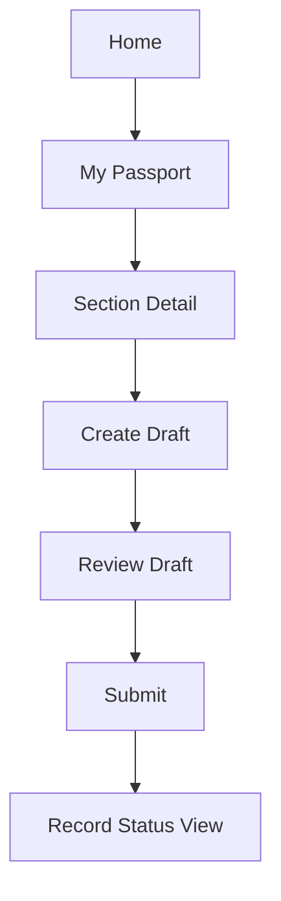
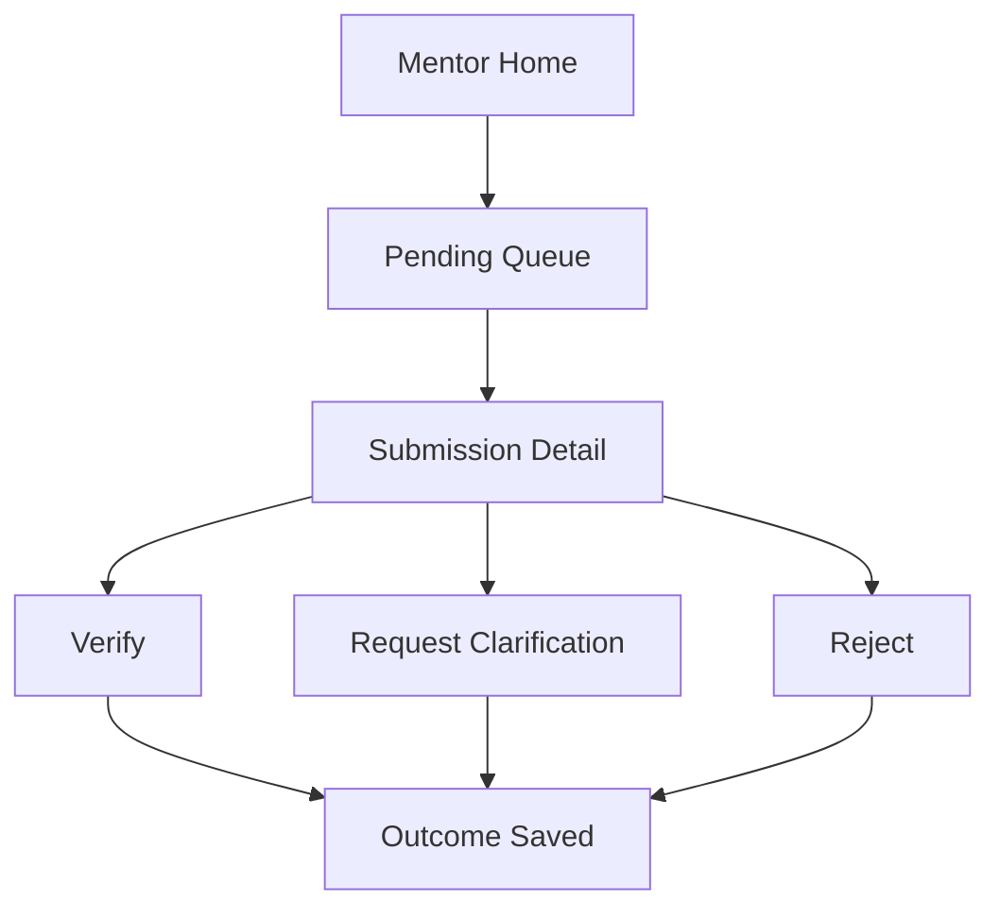
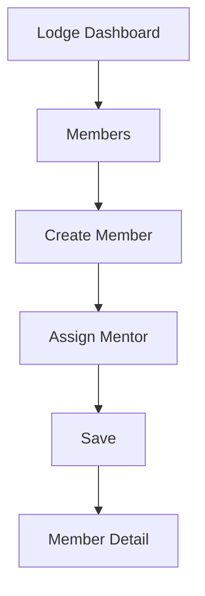
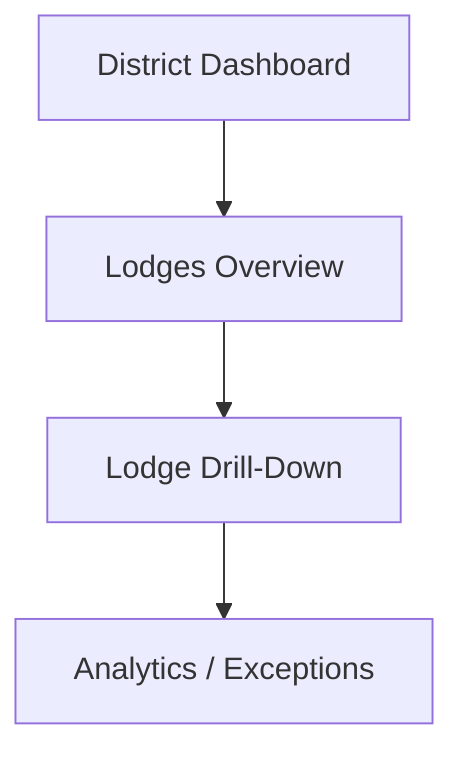

# DGLEA Masonic Passport — Screen Map and Navigation

**Document Status:** Draft v1  
**Intended Repository Use:** Save as `.md` in GitHub  
**Project:** DGLEA Masonic Passport  
**Date:** 2026-04-06  

---

## 1. Purpose

This document defines the initial **screen inventory**, **navigation model**, and **role-based screen access** for the DGLEA Masonic Passport platform.

This is not a visual design document. It is a structural UX document intended to stop the frontend from drifting into improvisation.

---

## 2. UX Position

The UX must support two distinct realities:

1. **day-to-day operational use on Android** by Brothers and mentors; and  
2. **administrative and district oversight use on the web** by lodge and district roles.

Trying to force both equally into one UI style would be a mistake.

---

## 3. Primary Experience Split

## 3.1 Android App
Primary use cases:
- Brother views and updates own passport
- mentor reviews assigned/pending items
- quick verification actions
- notification-driven action flow

## 3.2 Web Admin Portal
Primary use cases:
- lodge configuration
- member and mentor assignment
- dashboard review
- district analytics
- report generation
- support/admin actions

---

## 4. Android Screen Inventory

## 4.1 Authentication Flow
1. **Splash / Loading**
2. **Sign In**
3. **Session Recovery / Retry**
4. **Force Update / Maintenance Screen** (if needed later)

## 4.2 Common Core Screens
5. **Home Dashboard**
6. **Notifications**
7. **Profile / Account**
8. **Settings / Notification Preferences**
9. **Help / Support**

## 4.3 Brother Screens
10. **My Passport Overview**
11. **Passport Section Detail**
12. **Passport Item Detail**
13. **Create / Edit Draft Record**
14. **Submit Record Confirmation**
15. **Record History / Status View**
16. **My Progress Summary**
17. **My Mentor Assignments**

## 4.4 Mentor Screens
18. **Mentor Dashboard**
19. **Assigned Brothers List**
20. **Assigned Brother Detail**
21. **Pending Verification Queue**
22. **Verification Action Sheet / Screen**
23. **Clarification Request Screen**
24. **Rejection Screen**
25. **Mentor Notes / Operational Notes View**
26. **Lodge Queue View** (for Lodge Mentor role)

---

## 5. Web Admin Portal Screen Inventory

## 5.1 Common Admin Screens
1. **Admin Sign In**
2. **Admin Home / Landing**
3. **My Account**
4. **Global Search**
5. **Notifications / Alerts**
6. **Audit / Support Entry Point** (role-controlled)

## 5.2 Lodge Admin Screens
7. **Lodge Dashboard**
8. **Lodge Members List**
9. **Member Detail**
10. **Create / Edit Member**
11. **Mentor Assignment Management**
12. **Lodge Configuration**
13. **Lodge Supplement Items Management**
14. **Lodge Reports**
15. **Pending Verification / Exception Queue**

## 5.3 Lodge Leadership Reviewer Screens
16. **Lodge Summary Dashboard**
17. **Read-Only Member Progress Summary**
18. **Read-Only Readiness View**

## 5.4 District Screens
19. **District Dashboard**
20. **District Lodges Overview**
21. **Lodge Drill-Down**
22. **District Analytics**
23. **District Reports**
24. **District User and Role Management**

## 5.5 System / District Admin Screens
25. **Feature Flags**
26. **District Template Management**
27. **User Scope Role Management**
28. **Audit Search**
29. **Support / Correction Tools**
30. **System Configuration**

---

## 6. Android Navigation Model

### 6.1 Recommended Primary Navigation
Use bottom navigation or equivalent with 4–5 primary tabs:

- **Home**
- **Passport**
- **Tasks** (or Queue for mentors)
- **Notifications**
- **Profile**

### 6.2 Role-Adaptive Navigation
The Android app should adapt by role.

#### Brother
Primary tabs:
- Home
- Passport
- Notifications
- Profile

#### Personal Mentor
Primary tabs:
- Home
- Tasks
- Assigned
- Notifications
- Profile

#### Lodge Mentor
Primary tabs:
- Home
- Tasks
- Lodge
- Notifications
- Profile

### 6.3 Important UX Rule
Do not expose irrelevant tabs to roles that cannot meaningfully use them.

---

## 7. Web Navigation Model

### 7.1 Primary Admin Navigation
Recommended left-side nav groups:

- Dashboard
- Members
- Mentors
- Verification
- Reports
- Configuration
- District
- Audit
- Account

### 7.2 Role-Adaptive Web Navigation
#### Lodge Admin
- Dashboard
- Members
- Mentors
- Verification
- Reports
- Configuration

#### Lodge Leadership Reviewer
- Dashboard
- Members (summary)
- Reports

#### District Mentor
- District Dashboard
- Lodges
- Analytics
- Reports

#### District Admin / System Admin
- District Dashboard
- Lodges
- Users & Roles
- Templates
- Flags
- Audit
- Support

---

## 8. Key Screen Details

## 8.1 Android — Home Dashboard

### Brother home
Should show:
- welcome header
- current degree stage
- progress summary
- pending submissions
- latest verified items
- quick action: add record
- notifications/alerts

### Mentor home
Should show:
- pending verification count
- stale items
- assigned Brothers needing attention
- quick links into queue

### Lodge Mentor home
Should show:
- lodge-wide pending items
- stale items
- members without Personal Mentor
- key lodge health indicators

---

## 8.2 Android — My Passport Overview

Should show:
- four core sections
- completion indicators per section
- status badges
- quick navigation into each section
- lodge supplement indicators where relevant

Recommended section card content:
- section title
- verified count / total
- pending count
- last activity date

---

## 8.3 Android — Passport Section Detail

Should show:
- list of items in the section
- each item’s status
- event date if present
- verification status
- add/update action where allowed

Status badges:
- Draft
- Submitted
- Needs Clarification
- Verified
- Rejected

---

## 8.4 Android — Create / Edit Draft Record

Should include:
- section
- template item
- event date
- note / summary
- save draft
- submit action

UX rule:
Keep this simple. It should feel like a guided form, not an admin database UI.

---

## 8.5 Android — Pending Verification Queue

Should show:
- Brother name
- section/item
- submission date
- current status
- stale indicator
- quick action buttons:
  - verify
  - request clarification
  - reject

Lodge Mentor may additionally see:
- override route
- scope filters

---

## 8.6 Web — Lodge Dashboard

Should show:
- total active Brothers
- pending verifications
- stale verifications
- members with no Personal Mentor
- section progress trends
- quick links to exceptions

---

## 8.7 Web — Member Detail

Should show:
- member profile summary
- current degree status
- mentor assignments
- passport section progress
- submission history
- verification history
- lodge-relevant notes
- audit summary link if authorised

This is one of the highest-value admin screens.

---

## 8.8 Web — District Dashboard

Should show:
- total participating lodges
- active members across district
- pending verifications across district
- inactive or low-engagement lodges
- average verification turnaround
- drill-down by lodge

Important rule:
District dashboards should default to meaningful aggregated signals, not data dumping.

---

## 9. Navigation Flows

## 9.1 Brother Flow — Add and Submit Record

## 9.2 Mentor Flow — Verify Submission

## 9.3 Lodge Admin Flow — Onboard Member

## 9.4 District Mentor Flow — Review Lodge Analytics

---

## 10. Role-to-Screen Access Summary

| Screen Group | Brother | Personal Mentor | Lodge Mentor | Lodge Reviewer | Lodge Admin | District Mentor | District Admin |
|---|---:|---:|---:|---:|---:|---:|---:|
| Android Home | Y | Y | Y | N | N | N | N |
| My Passport | Y | N | N | N | N | N | N |
| Assigned Brothers | N | Y | Y | N | N | N | N |
| Pending Verification Queue | N | Y | Y | N | Limited read | N | Limited |
| Lodge Dashboard | N | Limited | Y | Y | Y | Drill-down limited | Y |
| Member Admin Screens | N | N | Limited | N | Y | N | Y |
| District Dashboard | N | N | N | N | N | Y | Y |
| Audit Screens | N | N | Limited | N | Limited | Limited | Y |
| Feature Flags | N | N | N | N | N | N | Y |

---

## 11. UX Guardrails

1. the mobile app must stay task-focused
2. the web portal must stay administration-focused
3. do not bury verification actions behind too many taps
4. do not show every user every possible status or admin concept
5. do not let district analytics screens become raw data dumps
6. do not expose private note affordances too widely

---

## 12. Deferred UX Items

These are useful later, but not required to start:
- rich onboarding tour
- offline draft sync
- advanced filter builder
- saved reports
- deep personalisation
- attachments/evidence upload
- public/shareable links

---

## 13. Final UX Position

The correct screen model is:

> **A simple, role-adaptive Android experience for day-to-day progress and verification, paired with a stronger web portal for lodge and district administration, analytics, and governance.**
